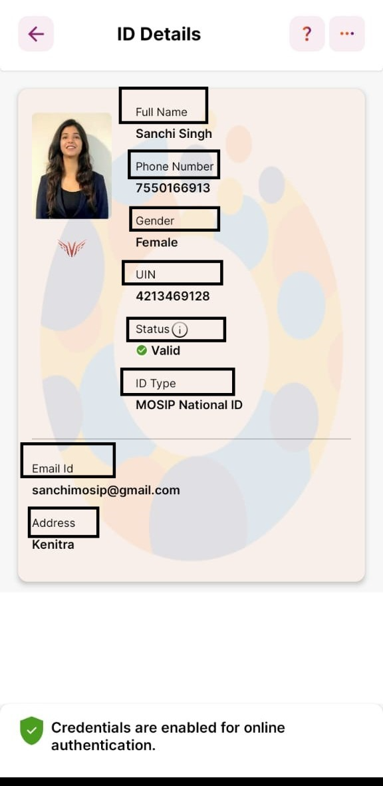
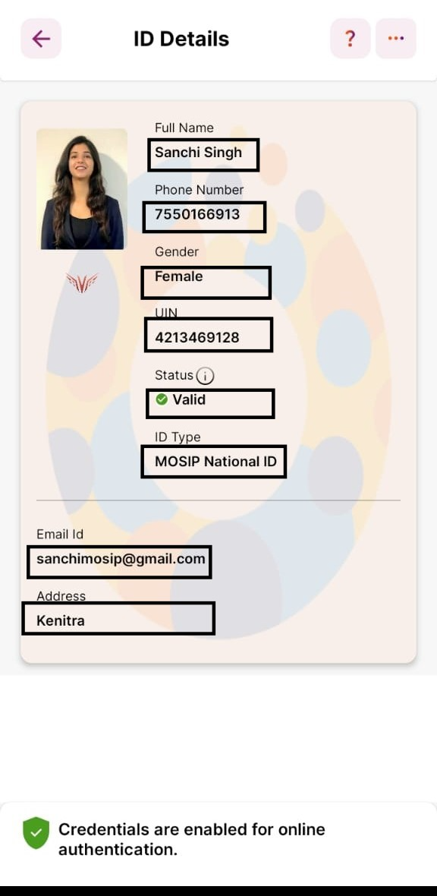
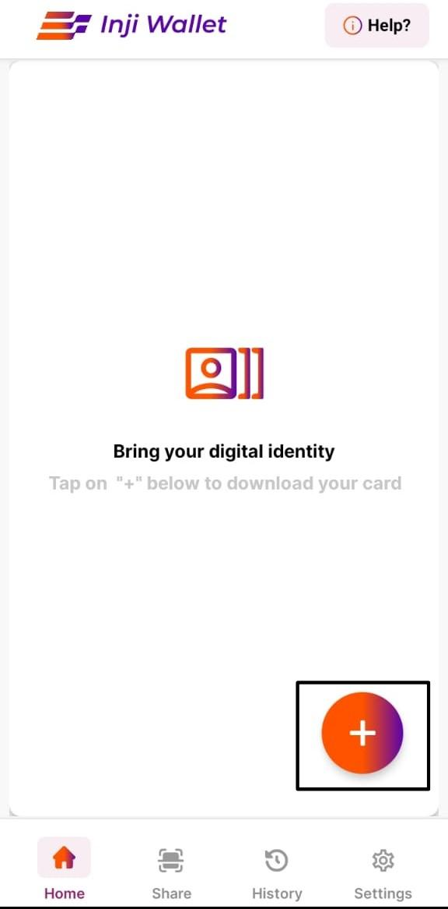
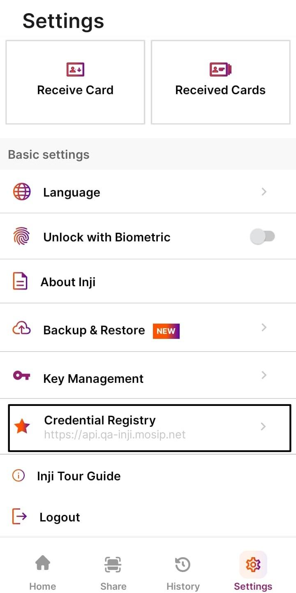
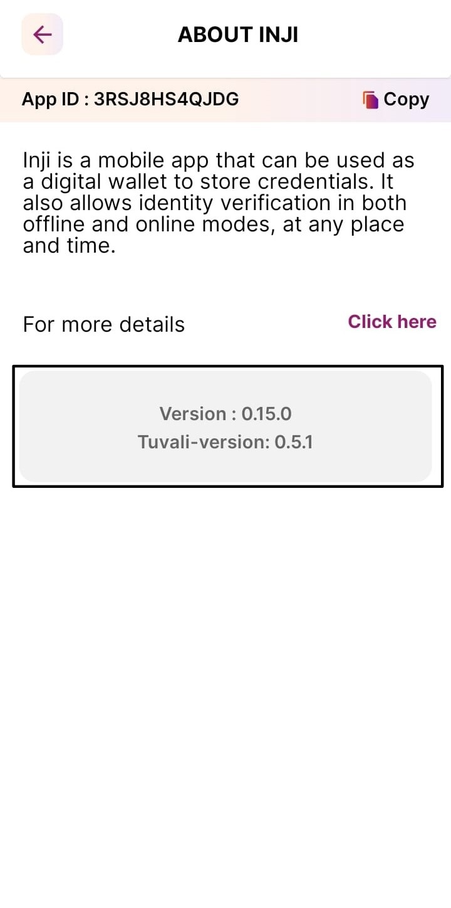

# UI customization

## CSS Themes

Currently, Inji Wallet supports two themes:

* orange
* purple

We can customize the application by adding a new file under `components/ui/themes` and import that file in `components/ui/styleUtils.ts` and assign that to `Theme` variable in it. Orange theme is referred as DefaultTheme.

```
Example:-
    components/ui/styleUtils.ts

    import { PurpleTheme } from './PurpleTheme';
    export const Theme = PurpleTheme;
```

### App Logo and Background Images

To change app logo on homescreen

```
HomeScreenLogo: require(path of logo you want to use, in string format) in a theme file

Example:-
import HomeScreenLogo from '../../../assets/InjiHomeLogo.svg';
export const DefaultTheme = {
    HomeScreenLogo: HomeScreenLogo
    ...
}
```

Profile logo is part of downloaded verifiable credential. If credential doesn't face/photo attribute, default profile icon is being used. 

To change the profile logo, In `ProfileIcon.tsx`, refer

```
import {Icon} from 'react-native-elements';
use `person` as icon from the library
```

Card background is driven by wellknown exposed by issuing authoriy. If background details are not exposed, default background is being used.
To change card background on home screen if not provided by issuer:

```
CloseCard: require(path of the image you want to use, in string format)

Example:-
export const DefaultTheme = {
    CloseCard: require('../../../assets/Card_Bg1.png'),
    ...
}
```

To change background on card details screen if not provided by issuer

```
OpenCard: require(path of the image you want to use, in string format)

Example:-
export const DefaultTheme = {
    OpenCard: require('../../../assets/Card_Bg1.png'),
    ...
}
```

To change the top header icons:


In `HomeScreenLayout.tsx`, refer

```
 var HomeScreenOptions = {
    headerLeft: () =>
      isIOS() || !isRTL
        ? SvgImage.InjiLogo(Theme.Styles.injiLogo)
        : screenOptions,
    headerTitle: '',
    headerRight: () =>
      isIOS() || !isRTL
        ? screenOptions
        : SvgImage.InjiLogo(Theme.Styles.injiLogo),
  };
```

### Colours

To change the text, colour and logo for Tabs:


In `main.ts`, there are 4 tab screens variables

```
const home: TabScreen
const scan: TabScreen
const history: TabScreen
const settings: TabScreen

```

`image` can be changed by `icon` attribute, `text` and `styles` can be changed by `options` attribute in `MainLayout.tsx` while rendering `Navigator`

```
Example:-
const history: TabScreen = {
  name: BOTTOM_TAB_ROUTES.history,
  component: HistoryScreen,
  icon: 'history',
  options: {
    headerTitleStyle: Theme.Styles.HistoryHeaderTitleStyle,
    title: i18n.t('MainLayout:history'),
  },
};
```

Card content text color is driven by wellknown exposed by issuing authoriy. If text color is not exposed, default color is being used.
To change default Label text color if not provided by issuer:



```
export const DefaultTheme = {
  Colors: {
     DetailsLabel: Colors.Gray40,
    ...
  }
}
```

To change default Label value color if not provided by issuer:



```
export const DefaultTheme = {
  Colors: {
     Details: Colors.Black,
    ...
  }
}
```

To change the colour of `+` icon colour:



In `HomeScreen.tsx`, refer `DownloadFABIcon` component

```
const DownloadFABIcon: React.FC = () => {
    const plusIcon
....
}
```

To change the colours of Label in Settings:



```
export const DefaultTheme = {
  Colors: {
     settingsLabel: Colors.Black,
     textLabel: Colors.Grey,
    ...
  }
}
```

To change the background and label colour for version section:



```
export const DefaultTheme = {
    Colors: {
      aboutVersion: Colors.Gray40,
      ...
    },
    Styles: StyleSheet.create({
      versionContainer: {
        backgroundColor: Colors.Grey6,
        margin: 4,
        borderRadius: 14,
    }
    ...
  })
}
```

To change colour on add new card page:


```
export const DefaultTheme = {
    Styles: StyleSheet.create({
    issuerHeading: {
      fontFamily: 'Inter_600SemiBold',
      fontSize: 14,
      paddingHorizontal: 3,
      marginBottom: 2,
      marginTop: 5,
    },
    issuerDescription: {
      fontSize: 11,
      lineHeight: 14,
      color: Colors.ShadeOfGrey,
      paddingVertical: 5,
      paddingHorizontal: 3,
      paddingTop: 1.4,
    }
    ...
  })
}
```

## VC Card Customization:

The VC can be dynamically rendered with all the fields, and if the display properties provided in the[ .well-known](https://injicertify-mosipid.collab.mosip.net/v1/certify/issuance/.well-known/openid-credential-issuer), Inji Wallet downloads the `.well-known` and applies the below properties on the VC template to modify the VC render.

* Text colour
* Background colour
* Logo change

```
{
  "display": [
    {
      "name": "MOSIP Identity Verifiable Credential",
      "locale": "en",
      "logo": {
        "url": "https://esignet.collab.mosip.net/logo.png",
        "alt_text": "a square logo of a Esignet"
      },
      "background_color": "#FDFAF9",
      "text_color": "#7C4616"
    }
  ]
}
```
