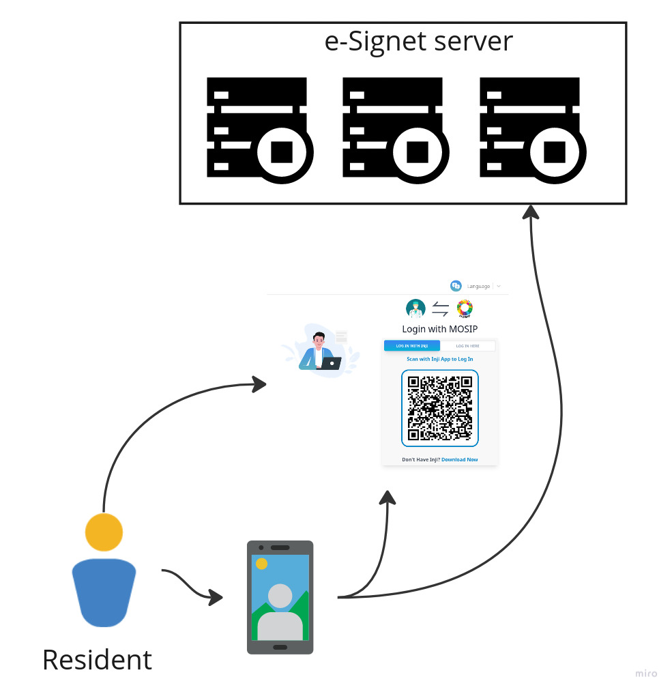
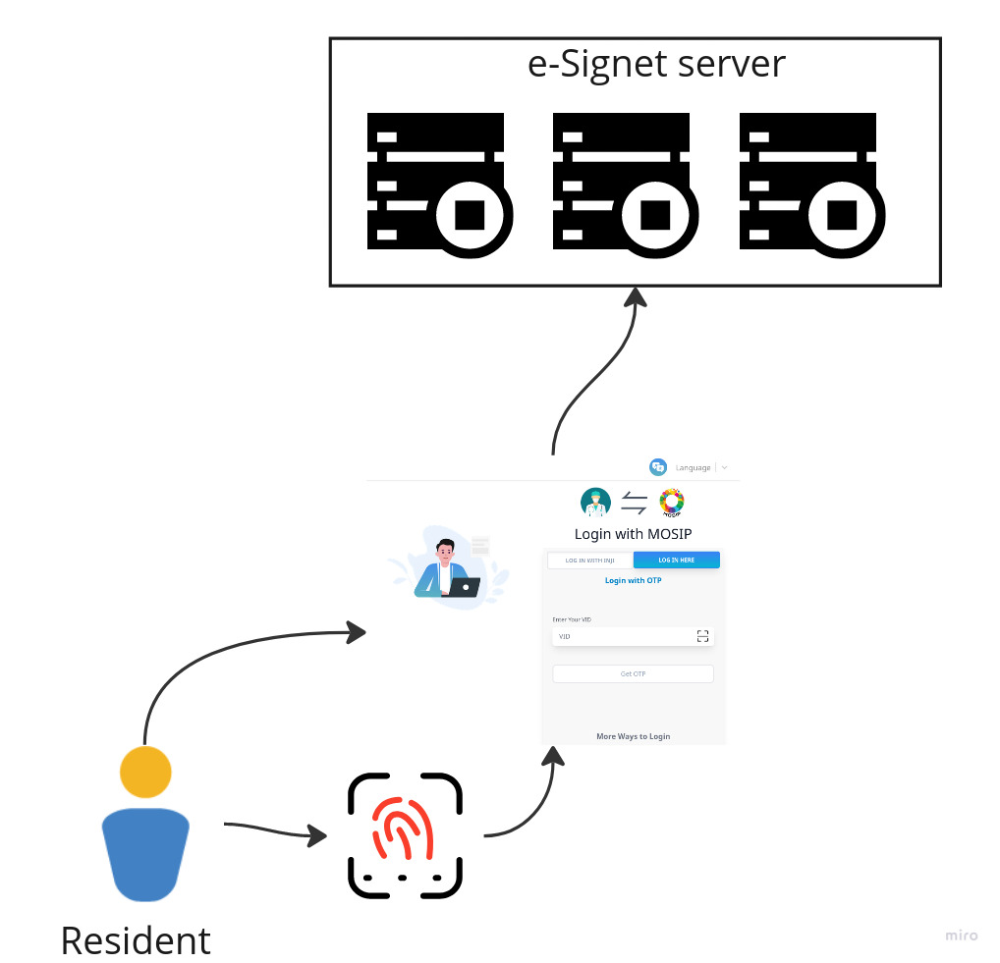

# MOSIP eSignet

In these times of digital transformation, most services are moving online globally. Personalized access to online services is enabled through the use of a trusted digital identity. **eSignet** aims to offer a simple yet powerful mechanism for end users to identify themselves in order to avail of online services and also share their profile information.

&#x20;eSignet supports multiple modes of identity verification to promote inclusion and increase access, thus narrowing potential digital divides. It also provides an elegant and easy way for an existing trusted identity database to make the identity digital and provision identity verification and service access.


There is a need to support more verification methods to be inclusive. Current approaches do not address privacy concerns comprehensively. We are constantly looking at ways to bridge the digital divide with better privacy. Here is a short introduction to identity verification methods. Also, do check out [Inji](https://app.gitbook.com/o/-M1FyzBr-VmticWYm8QI/s/aY8BQ4hdzhSchZV814Ev/) to understand modern approaches to identity using verifiable credentials for decentralized verification.


 

**What can eSignet be used for?**

* eSignet can be a login provider for a relying party application to enable access to the service without creating yet another set of login credentials (username/password combination).
* eSignet can be used for assured identity verification of an individual against an identity provider. The identity provider could be a national identity database/ driver's license system/ passport license system or any other trusted identity provider. The assurance level is based on the authentication factor used, with biometric authentication offering user presence assurance.
* eSignet can be used for consented data sharing for profile creation or eKYC needs of relying parties. Authentication requests from a relying party can be accompanied by a request for a set of attributes suitable for profile creation or meeting eKYC process norms. The requested information is shared after the user provides consent as part of the eSignet login flow.

To know more about eSignet, its features, components, integrations etc., read through the [eSignet documentation](https://docs.esignet.io/).

To know more about integrations with MOSIP, refer to the following documents:

* [ID Authentication](https://docs.mosip.io/1.2.0/integrations/e-signet/ida)
* [Partner Management](https://docs.mosip.io/1.2.0/integrations/e-signet/partner-management)
* [Configuring eSignet](https://docs.mosip.io/1.2.0/integrations/e-signet/configuring-esignet)
