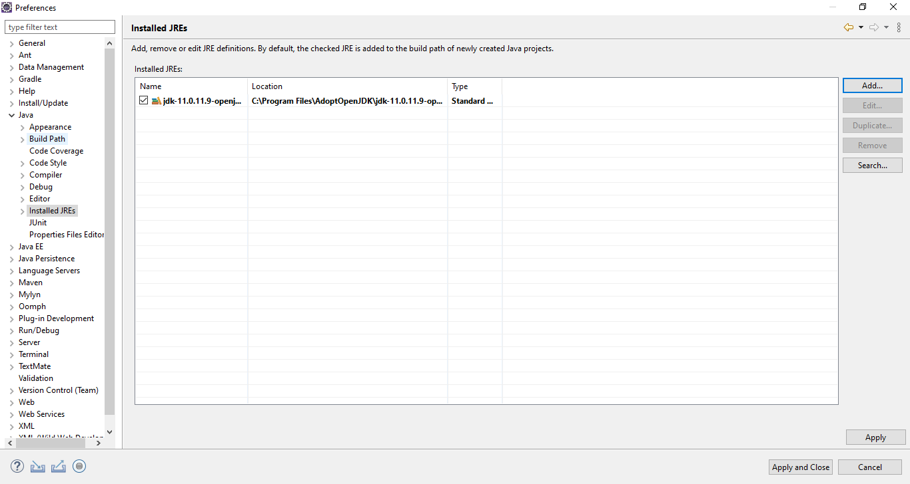
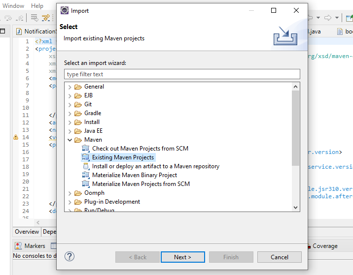
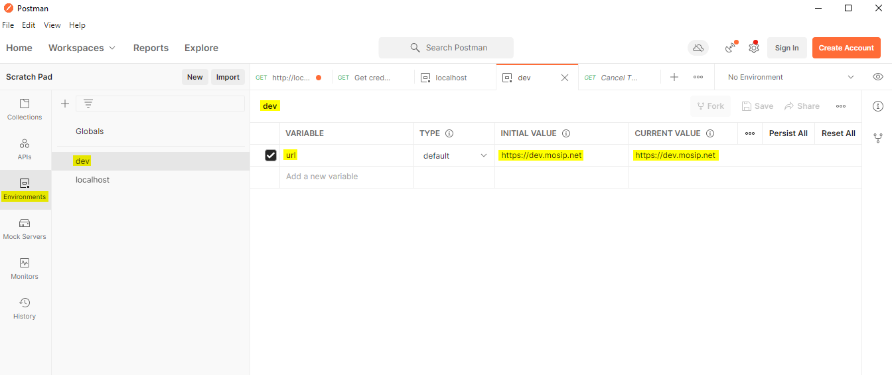

# Admin Services Developers Guide

## Overview

The admin application is a web-based application used by a privileged group of administrative personnel to manage various master data. The various resources that can be managed by an administrator are:

* Center (Registration centers)
* Device
* Machine
* User (Admin, Registration staff)

Along with resource and data management, the admin can generate master keys, check registration status, retrieve lost RIDs, and resume processing of paused packets.

* **Masterdata Service** exposes API to perform CRUD operations on masterdata through Admin service.
* **Hotlist Service** provides functionality to block/unblock any IDs with option of expiry. This hotlisted information will also be published to MOSIP\_HOTLIST WebSub topic.
* **Sync Data Service** can be accessed only by the privileged group of admin personnel and enables default configurations and seed data to be setup when the MOSIP platform gets initialized.

The admin module has four services:

* Admin service
* Kernel Masterdata service
* Kernel Syncdata service
* Hotlist service

The documentation here will guide you through the pre-requisites required for the developer' setup.

## Software setup

1. JDK 11
2. Any IDE (like Eclipse, IntelliJ IDEA)
3. Apache Maven (zip folder)
4. pgAdmin
5. Postman
6. Git/GitHub Desktop
7. Notepad++ (optional)
8. lombok.jar (file)
9. settings.xml

Follow the steps below to set up Admin Services on your local system:

1. Download [lombok.jar](https://projectlombok.org/download) and [settings.xml](../../\_files/pre-registration-config-files/settings.xml).
2. Unzip Apache Maven and move the unzipped folder in `C:\Program Files` and `settings.xml` to `conf` folder `C:\Program Files\apache-maven-3.8.4\conf`.
3. Install Eclipse, open the `lombok.jar` file and wait for some time until it completes the scan for Eclipse IDE and then click `Install/ Update`.

1. Check the Eclipse installation folder `C:\Users\userName\eclipse\jee-2021-12\eclipse` to see if the `lombok.jar` is added. By doing this, you don't have to add the dependency of `lombok` in your `pom.xml` file separately as it is auto-configured by Eclipse.
2. Configure the JDK (Standard VM) with your Eclipse by traversing through `Preferences → Java → Installed JREs`.

## Code setup

For the code setup, clone [admin-services](https://github.com/mosip/admin-services) repository and follow the guidelines mentioned in the [Code Contributions](https://docs.mosip.io/1.2.0/community/code-contributions).

### Importing and building of a project

1. Open the project folder where `pom.xml` is present.
2. Open command prompt from the same folder.
3. Run the command `mvn clean install -Dgpg.skip=true -DskipTests=true` to build the project and wait for the build to complete successfully.
4. After building of a project, open Eclipse and select `Import Projects → Maven → Existing Maven Projects → Next → Browse to project directory → Finish`.
5. After successful importing of project, update the project by right-click on `Project → Maven → Update Project`.

## Environment setup

1. For the environment setup, you need an external JAR that is available [here](https://oss.sonatype.org/#nexus-search;gav\~\~kernel-auth-adapter\~1.2.0-SNAPSHOT\~\~) with different versions. (E.g.: You can download `kernel-auth-adapter.jar` and add to project `Libraries → Classpath → Add External JARs → Select Downloaded JAR → Add → Apply and Close`).

1. Clone [admin-services repository](https://github.com/mosip/admin-services).
2. Any changes in the properties for Masterdata and Admin services should be done in `application-local1.properties` file.
3. By default the Admin-services is connected to dev environment.
4. To run the specific service from IDE, `Open IDE -> Specific service -> src/main/java/io.mosip.specific service -> Right click on the file and select run as Java Application`.

For example, to run the Admin service, `open IDE -> admin-service -> src/main/java/io.mosip.admin -> Right click on AdminBootApplication.java and select run as Java Application`.

1. To run the specific service from Command Prompt, Open Project folder -> open command prompt from same folder -> Execute `java -jar target/specific-service-1.2.0.jar`.

For example, to run the admin service, Open Project folder -> open command prompt from same folder -> Execute `java -jar target/admin-service-1.2.0-SNAPSHOT.jar`.

The service should now be up and running.

## Admin services API

* For API documentation, refer [here](https://docs.mosip.io/1.2.0/api).
* The APIs can be tested with the help of **Swagger-UI** and **Postman**.
* Swagger is an interface description language for describing restful APIs expressed using JSON. You can access Swagger-UI of admin-services for dev-environment from:

**Admin service**– `http://dev.mosip.net/v1/admin/swagger-ui/index.html?configUrl=/v1/admin/v3/api-docs/swagger-config#/` and localhost from `http://localhost:8098/v1/admin/swagger-ui/index.html?configUrl=/v1/admin/v3/api-docs/swagger-config#/`.

**Masterdata**- `http://dev.mosip.net/v1/masterdata/swagger-ui/index.html?configUrl=/v1/masterdata/v3/api-docs/swagger-config#/` and localhost from `http://localhost:8086/v1/masterdata/swagger-ui/index.html?configUrl=/v1/masterdata/v3/api-docs/swagger-config#/`.

**Syncdata**- `http://dev.mosip.net/v1/syncdata/swagger-ui/index.html?configUrl=/v1/syncdata/v3/api-docs/swagger-config#/` and localhost from `http://localhost:8089/v1/syncdata/swagger-ui/index.html?configUrl=/v1/syncdata/v3/api-docs/swagger-config#/`.

**Hotlist**- `http://dev.mosip.net/v1/hotlist/swagger-ui/index.html?configUrl=/v1/hotlist/v3/api-docs/swagger-config#/` and localhost from `http://localhost:8095/v1/hotlist/swagger-ui/index.html?configUrl=/v1/hotlist/v3/api-docs/swagger-config#/`

* Postman is an API platform for building and using APIs. Postman simplifies each step of the API lifecycle and streamlines collaboration so you can create better APIs—faster. It is widely used tool for API testing.
* Create an environment as shown in the image below.

This environment is created for dev. Give the variable name as `url` and set both the values as `https://dev.mosip.net`.

* In the similar way, create another environment for localhost as shown below.

This environment is created for localhost. Give the variable name as `url` and set both the values as `http://localhost:8099`.

